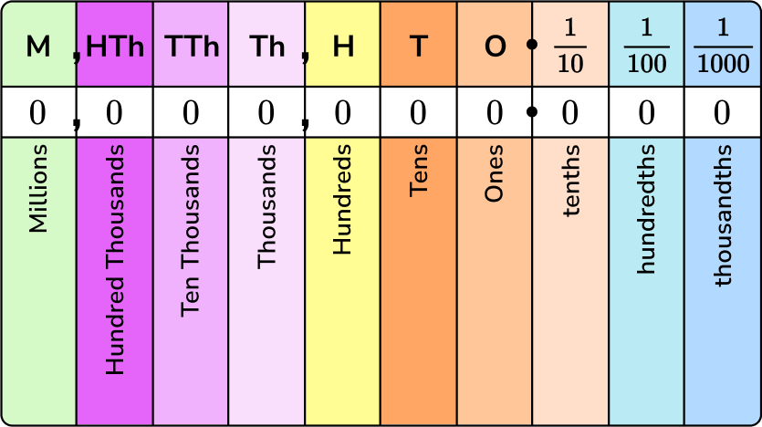
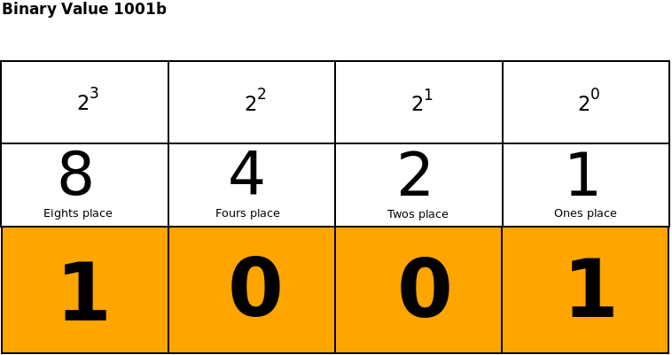
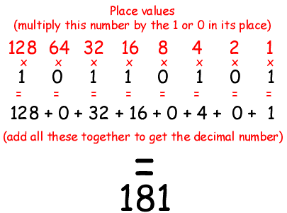
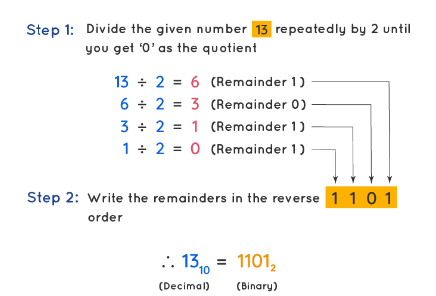

# Binary

## What is Binary?
**Binary** is a numerical system used in computing that relies on only two digits: 0 and 1. In contrast to the *decimal* system, which uses 10 digits (0 through 9), binary simplifies computations within digital electronic devices, as they are based on the presence or absence of electrical charge, represented respectively by 1 and 0.

In **digital computers**, everything is represented and processed in binary form. This includes numbers, characters, instructions, and any other data. The fundamental unit of data in a computer is the binary digit, or bit. Multiple bits are grouped together to represent more complex data types. For example:

- A group of 8 bits is called a **byte**, which can represent numbers from 0 to 255 or characters based on ASCII encoding.
- 16 bits can represent larger numbers, up to 65,535, or characters in Unicode encoding.
- And so on, with larger groupings like 32-bit or 64-bit words used for even more extensive data representation.

Digital computers operate using binary logic, which means that all computations, operations, and data manipulations are ultimately based on simple binary operations like AND, OR, and NOT. These operations are implemented using electronic circuits called logic gates, which perform binary operations on binary inputs.

For instance, an AND gate outputs 1 only when both of its inputs are 1. An OR gate outputs 1 if either or both of its inputs are 1. A NOT gate (also called an inverter) outputs the opposite of its input (1 becomes 0, and 0 becomes 1). These gates can be combined to create more complex logic circuits that perform arithmetic operations, comparisons, and other tasks necessary for computing.

In summary, binary is the foundation of digital computing, providing a straightforward way to represent and process data using only two symbols. By leveraging binary logic and electronic circuits, computers can perform complex operations, store vast amounts of information, and execute various tasks efficiently.

---
## Representing Numbers in Binary

Binary is a number system, just like the base-10 system we use everyday. This means we can represent any base-10 number in binary. 

First, you're probably familiar with the **place values** in base-10:

Notice that each position value is **TEN** times the position to its right. For example, the thousands place is **TEN** times the position to its right, the hundreds place.

Now, let's take a look at the position values for base-2 (or binary):

Notice that each position value is **TWO** times the position to its right. 

The first numbers (0-10) in binary are:
| Binary | Decimal |
|--------|---------|
| 0      | 0       |
| 1      | 1       |
| 10     | 2       |
| 11     | 3       |
| 100    | 4       |
| 101    | 5       |
| 110    | 6       |
| 111    | 7       |
| 1000   | 8       |
| 1001   | 9       |
| 1010   | 10      |

:::tip 
Notice that 00001 is the same as 1 in binary, similar to how 00001 is the same as 1 in decimal. 

:::
---
## Converting Binary to Decimal
Take the number 503 in **decimal**. It has:
- 3 in the 1's place. So, we have three 1's
- 0 in the 10's place. So, no 10's
- 5 in the 100's place. So we have five 100's
Adding that up, we have 503.

We do something similar when converting a binary number to decimal. Take the number 1001 in **binary**. It has:
- 1 in the 8's place. So we have one 8.
- 0 in the 4's place. 
- 0 in the 2's place.
- 1 in the 1's place. So we have one 1.
Adding that up, we have 9.

Here's a detailed look at converting a **binary** number to **decimal**:

---
## Converting Decimal to Binary
Now what about the other way? This is a bit harder.

To convert a number from **decimal** to **binary**, do the following:

- Divide the given decimal number by 2 and note down the remainder.
- Now, divide the obtained quotient by 2, and note the remainder again.
- Repeat the above steps until you get 0 as the quotient.
- Now, write the remainders in such a way that the last remainder is written first, followed by the rest in the reverse order.

Here is an example. Let's convert the decimal number 12 to binary.

First, we 12 divide by 2. We get 6, with a remainder of 0.
Then, we 6 divide by 2. We get 3, with a remainder of 0.
Then, we divide 3 by 2. We get 1, with a remainder of 1.
Finally, we divide 1 by 2. We get 0, with a remainder of 1. 

So, writing the remainders in reverse order, we have 1100.

Here's a more clear example:

Let's convert the decimal number 25 to binary.
- 25 / 2 = 12, remainder 1
- 12 / 2 = 6, remainder 0
- 6 / 2 = 3, remainder 0
- 3 / 2 = 1, remainder 1
- 1 / 2 = 0, remainder 1
So the decimal number 25 is 11001 in binary. 

We can convert this back into decimal to make sure:
- 1 in the 16's place
- 1 in the 8's place
- 0 in the 4's place
- 0 in the 2's place
- 1 in the 1's place
Adding up 16+8+1, we get 25. So the binary number 11001 is 25 in decimal.