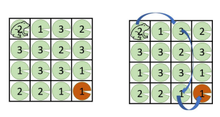

# Two Dimensional Dynamic Programming

Sometimes, when you're solving subproblems that are a bit more complex, you'll need more than just a single array to store the results of your subproblems. This is where **Two-dimensional dynamic programming** comes in, where intermediate results of subproblems are stored in a table (or 2D array).

The procedure for implementing 2D-DP is similar to 1D-DP. Let's take a look at an example.

### 2-DP Example: Froggy!🐸

You are a frog and you start on the upper left corner of a *nxn* square pond. There is a lily pad on every lattice point of the pond. Each lily pad has a bounciness where you can bounce exactly the amount of distance from that lily pad directly to the right or directly down.

The bounciness is given to you as an array where `A[1, 1]` is the bounciness of the lily pad in the top-left corner and `A[n, n]` is the bounciness of the lily pad in the bottom right corner.

*Determine if it is possible to reach the bottom-right lily pad from the top-left lily pad*.

1. **Subproblems**: Define `B[i, j]` to be TRUE if you can reach the (i, j) lily pad within the constraints, and FALSE otherwise.
    
2. **Base Cases**: `B[1, 1]` = TRUE, since you start there.
    
3. **Recursion**: You can reach lily pad (i, j) from a lily above, or from a lily to the left. So we iterate through all of the cells directly above and to the left, and `B[i, j]` is TRUE if *any* of them return true. So we have:
    
    * `B[i, j] = OR(B[i', j'])`, where:
        
        * `1 ≤ j' < j` (any lily to the left) and `j - j' = A[i, j']` (you can legally bounce from that lily to the current one)
            
        * `1 ≤ i' < i` (any lily from above) and `i - i' = A[i', j]` (you can legally bounce from that lily to the current one)
            
4. **Ordering**: Since you can only travel to the right or down, we must iterate in increasing order. We can iterate by the rows and then the columns, or the columns and then the rows, as long as it is in increasing order.
    
5. **Output**: We will return `B[n, n]`
    

I'll leave the actual implementation of the algorithm up to the reader again.