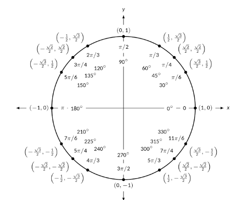

# Intro to Trigonometry: Practice Problems

**Resources:** [Link](https://math.libretexts.org/Bookshelves/Precalculus/APEX_PreCalculus_(Chapman_Herald_and_Libertini)/03%3A_Solving_and_Trigonometric_Functions/3.04%3A_Introduction_to_Trigonometric_Functions)

## Trig Definitions

Write the following in terms of $\sin (\theta)$ and $\cos (\theta)$:
- $\tan(\theta)$
- $\csc(\theta)$
- $\sec(\theta)$
- $\cot (\theta)$

---

## Evaluating Trigonometric Functions Using the Unit Circle

Evaluate each of the following. You can use the unit circle above.
- $\sin(\frac{\pi}{4})$
- $\cos(-\frac{3\pi}{4})$
- $\tan (\frac{\pi}{6})$
- $\csc(\frac{2\pi}{3})$
- $\sec(3 \pi)$
- $\cot(\frac{5\pi}{6})$

---

## Trig Function Rages

- What is the domain and range of the sine function?
- What is the domain and range of the cosine function?
- What is the domain and range of the tangent function?
- What is the domain and range of the secant function?
- What is the domain and range of the cosecant function?

---

## Using the Unit Circle
Find the ordered pair for the point of the unit circle associated with $\theta=\frac{5\pi}{4}$

Find the equation of the line that interescts the unit circle at $\theta=\pi$ and $\theta=\frac{\pi}{3}$